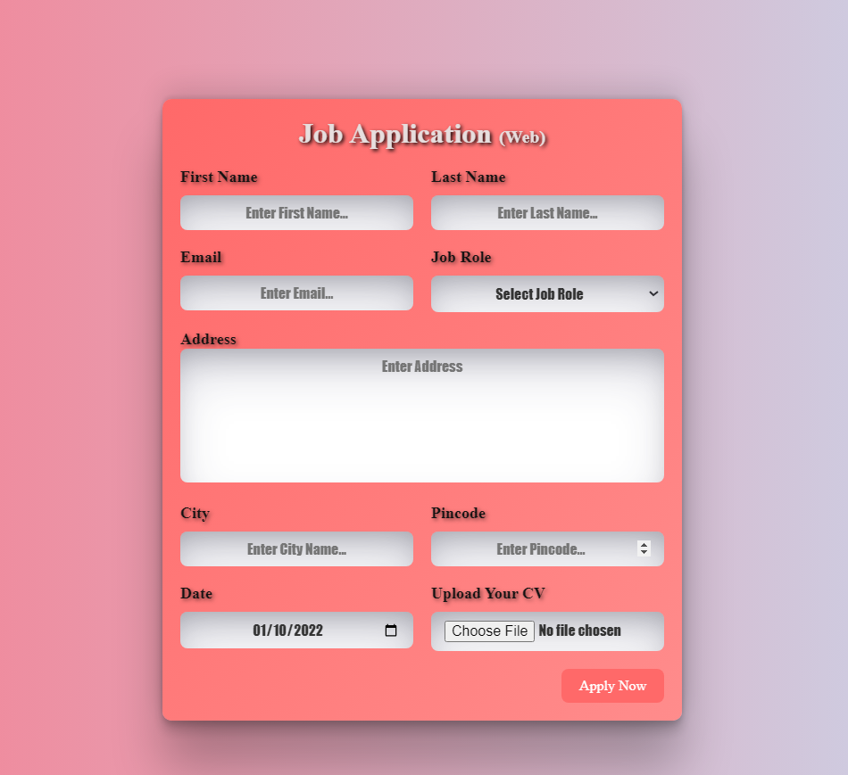

# 📝 Job Application Form

This is a simple job application form created using HTML and CSS.

## ✨ Features

- 🖥️ User-friendly interface
- 📱 Responsive design
- ✅ Input validation
- 🚀 Submission button

## 🚀 Usage

1. Clone the repository:

```
git clone https://github.com/DeepakScripter/HTML-CSS-JS-Explorer/tree/8979782198f68d32444efb5f9a0ac5796a285022/%F0%9F%93%9D%20Job%20Application%20Form%20%F0%9F%93%9D
```

2. Open the `index.html` file in your web browser to view the job application form.

## 📸 Screenshots



## 🤝 Contributing

Contributions are welcome! Please fork the repository and create a pull request with your changes.
